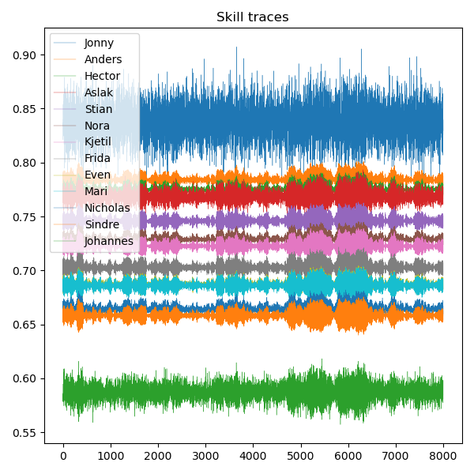

# Hierarchical Bayesian modeling of game scores

How does one compare the skill across multiple people if they did different tests of different difficulties? That is the question this data set forces us to answer.

## The data
The data set is a collection of scores from daily timequessr challenges collected by Hector. The goal of the game is to guess both the location and year of a photography, and with 5 attempts á 10 000 points, the maximum possible score for each day is 50 000.

## The model
The model should consider at least two factors: the skill of each player, which determines is the crux of the matter, and the difficulty of each daily test. With that as the only requirement, I assumed the data was normally distributed. 

In particular, assume that player $i$ has skill $\theta_i$ and day $j$ has difficulty $\sigma_j$, then score is distributed according to the following distribution:

$$
y_{i,j} \sim N(\theta_i + \sigma_j, \sigma^2_y)
$$

Then, all we have do to is to estimate $\theta_i$, and the player with the highest skill is, of course, the best player.

Since we are doing this in a bayesian fashion, we need to find the posterior distribution for the skill, i.e.

$$
\theta_i | y, \sigma^2_y, \sigma_{i:n}
$$

Where $\sigma_{i:n}$ is the vector of difficulties for all days. The challenge posed by this problem is that the estimated difficulties depends on the estimated skills and vice verse. Furthermore, since there are $n=34$ days and $p=13$ players, this amounts to $47$ parameters minimum, which is considerable given that there are only $224$ samples across all participants. Therefore, a hierarchical model I used instead.

## Hierarchical model
The hierarchical model assumes the following structure:

* The participants skills are samples from a single probability distribution
* The daily difficulties are samples from a single probability distribution

We must therefore simply determine these probability distributions, and Bayes' rule will dictate the rest. Again I assume a normal model for both of these since they are conjugate:

$$
\theta_i \sim N(\mu_{\theta}, \sigma^2_{\theta})
$$

$$
\sigma_j \sim N(\mu_{\sigma}, \sigma^2_{\sigma})
$$

Here is a diagram showing only the dependence, and not the distributions. Latent variables are red, free variables are blue, and the observed variables are black

  

Finally, we need a prior on all the variances $\sigma^2_y, \sigma^2_{\theta}, \sigma^2_{\sigma}$. Since an inverse gamma is conjugate, I chose this with somewhat vague distribution, reflecting that I have no real idea of what the values should be.

The code then performs a simple Gibbs sampler, where it first samples all the skill parameters, then all the difficulty parameters.

## The results
Here are the observed scores, left, and the calculated expected scores, right: 

  

We see a general trend of decreasing difficulty towards the end. Since we have no reason to believe that the quizzes became any easier, but rather that we got better, it seems that this simple model of constant skill is not entirely appropriate. For the purposes of determining the best player however, it will still suffice.

Following is the skill estimates:

  

Even though Jonny only participated once, his score was very good considering the difficulty of that day. Even when taking into account the uncertainty of only one observation, his is still significantly better. Johannes on the other hand experienced the reverse, with three unfortunate atempts. The model prefference for few observations might indicate that it is badly specified, and does not regress enough to the mean. Furthher analysis is needed. Otherwise the results seems very reasonable.

We have the difficulty of each day as well:

  

Only one day, 07/03, stands out significantly. It was a particular difficult day, and inspecting the observed scores suggests the same. We may also inspect the day of Jonny's only attempt, 07/29, and the estimated difficulty was about -2400. His estimated skill is therefore approximately 2400 more than the observed score, explaining the large gap. Was he just luck? Possibly, but if so, very lucky.

### Are there any particularly good or bad scores?
An interesting question is to consider the difference in expected score and observed score:

  

We see that Nicholas had a bad start (red squares in the top), but this is probably due to the fact that he misunderstood the game at first. Mari started out very strong on the other hand. These results are however dependent: How good Mari's score is depends on how bad Nicholas' score is. Both Nora and Mari also had one particularly unlucky day. On thhe flip side, Nicholas and Even (me!) also where lucky once.

Given that we assumed a normal model on the observed scores, we can compute the p value of all the observations. I did this, then checked if they were an outlier at a significance level of 0.05 with a two-sided test:

  

To no surprise, the same days plus some are indicated. Again, we see the skewness where the surprisingly bad observations are in the beginning, while the surprisingly good ones are at the end, suggesting that a more sophisticated model is appropriate.

## Chain diagnostic
For the interested, here are the chain traces:

  

  

They show very good mixing and convergence, thanks to the Gibbs sampling.

## Model diagnostic

I did some very basic model diagnostic with a Quantile-Quantile plot. First, the qq plot for a simple i.i.d. normal model, which assumes that all observations come from the same normal distribution:

  

The concavity indicates that the data is left skewed. This should not be surprising since the max score is 50 000, and the mean is about 70 percent of that.

For the residuals of the model, which is assumed to be normal due to how it is constructed, we see less of this effect.

  

This means that they are less skewed. However so, the plot still indicates some skewness.

## Some discussion

This analysis has been fun, and worked surprisingly well. There are however still some problems. The model should be a regression model of a sort, taking into account the development of skill, and not the least, understanding of the game. 

The skewness probably comes from the fact that the data is not normally distributed. Since there is a theoretical maximum, i.e. 50 000, a normal model is only an appropriate approximation if it gives exceedingly little probability of getting a score higher than this. Apparently, we were so proficient that this was not really the case. A solution to this is to scale the data to the interval [0,1], and fit a Beta distribution. This would satisfy the domain constraints of the data, and it would converge to a normal distribution outside the edges, thus preserving the nice properties of a normal model where it is appropriate.